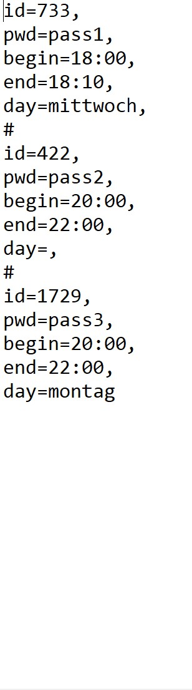

Auto-Login/Logout für Zoom (Win)
=========================================

Java-Programm für automatisierten Log-in/Log-out zur Teilnahme an Besprechungen via Zoom.

# Information
* Beim Hochfahren des PC's wird mit Hilfe einer Batch-Datei das Programm gestartet.
* Die gegebene `meetings`-Datei wird gelesen und aktuell laufende Meetings gesucht.
* Existiert so ein Meeting, Teilnahme erfolgt automatisch. Nach dem Beenden des Meetings wird der PC runtergefahren.
* Anderenfalls passiert nichts, PC geht nicht runter.

# Installation
* Erwerben Sie die `jar`-Datei auf dieser Seite, oder das Projekt selbst `build`en.
* Erstellen Sie Ihre eigene `meetings.txt`-Datei.
* Erstellen Sie eine Batch-Datei und fügen Sie hinzu:
  * `javaw -Xmx200m -jar C:\Path\To\Jar C:\Path\To\Meetings`, wobei `jar`-und `meetings.txt`-Dateien können in irgendeinem Folder stehen.

* Drücken Sie die `windows-Taste` und `R`. Führen Sie dort `shell:startup` aus.
* Fügen Sie die Batch-Datei diesem Ordner hinzu.
* Schließen Sie dieses Ordner.

# Meetings-Datei-Regelungen (csv)
Beachte, dass `day`-Variable optional ist.

